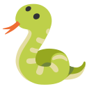

# Snake Game

A simple Snake game built for learning purposes.

## Features

- Classic snake gameplay
- Simple controls
- Minimalist design

## Controls

- **Arrow keys**: Move the snake

## Contributing

Pull requests are welcome! For major changes, please open an issue first.

## To-Do

- [X] Implement game start and restart functionality
- [X] Add scoring system
- [X] Handle snake collision with walls and itself
- [X] Add food spawning and consumption logic
- [ ] Implement increasing difficulty (speed up over time)
- [ ] Add sound effects
- [ ] Improve mobile controls
- [ ] Polish UI and add animations

## License

This project is for educational purposes.
